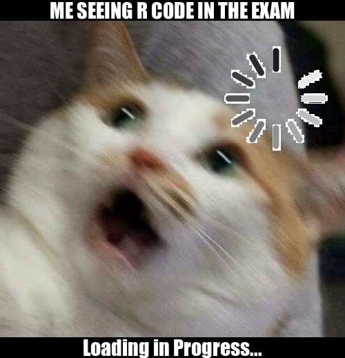

```{css}
center {
  display: block;
  margin-left: auto;
  margin-right: auto;
  width: 50%;
}
```

# **STATS220 ASSIGNMENT 1**
## 1. *My MEME*
*See the images below:*
- *The first image is the original image I used to create my meme*
- *The second image is the meme I created using the R package {magick}!*
<br>
<br>
<br>*P.s The original image was adapted from the website called [Pinterest](https://www.pinterest.nz/). It is an exciting website with blogs where you can find a lot of entertaining images and posts.*

## 2. *R code*
```r
library(magick)

#Gathering the webistes of images
url_1 <- "https://i.pinimg.com/564x/4e/c4/f2/4ec4f2d69c9bc6b152abcb420252c3a8.jpg"
url_2 <- "https://ak.picdn.net/shutterstock/videos/1009250978/thumb/1.jpg"

#Loading the first image and scale it down
meme_image <- image_read(url_1) %>% 
  image_scale(500)

#Loading the second image and scale it down
meme_loading <- image_read(url_2) %>% 
  image_scale(400) %>%
  image_crop("300x300+125") %>% 
  image_transparent('white')

#Create top text box
meme_background <- image_blank(500,30, color = "black") %>%
  image_annotate("ME SEEING R CODE IN THE EXAM", 
                 color = "white", 
                 size = 30,
                 font = "Impact",
                 gravity = "center")

#Create bootom text box
meme_background_2 <- image_blank(500,30, color = "black") %>%
  image_annotate("Loading in Progress...", 
                 color = "white", 
                 size = 30,
                 font = "Impact",
                 gravity = "center")
  
#Combining two images
meme <- image_composite(meme_image, meme_loading, offset = "+325+0")

#Appending the text boxes
meme <- c(meme_background,meme,meme_background_2) %>%
   image_append(stack=TRUE)

#Saving the meme as an image file
image_write(meme, "my_meme.png")
```

## 3. *Motivation*
*R code is an enjoyable language, but we will be facing it in the Stats220 examinations! I know it will be stressful for everyone to revise the R code before the examination, especially the exam is not open-book. So I thought, why not create some interesting meme about exams and R code that help everyone relax and chill!
Now here it comes with that meme. I hope everyone likes it! P.s. That cat is so cute!!! If you want to get your own cat meme, that [website](https://www.pinterest.nz/pin/419327415305550929/) might give you some inspiration.*

## 3. *The creation of meme*
*I'm a cat lover, and so I started searching for cute cat images on google first to give me inspirations. After seeing my original meme image, a shocked cat, I thought it would be interesting if I linked it with R code and Exam. I also searched a loading image to indicate the brain search process to make it more fun. *


